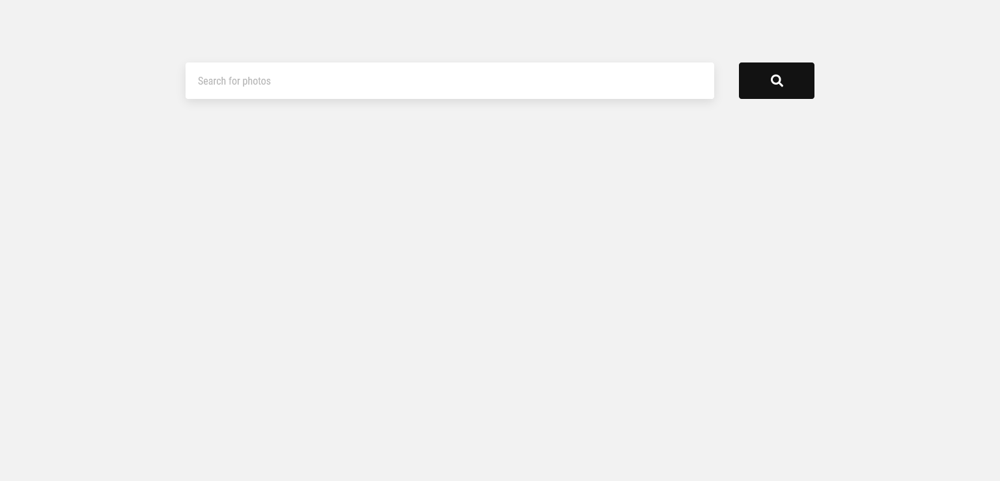
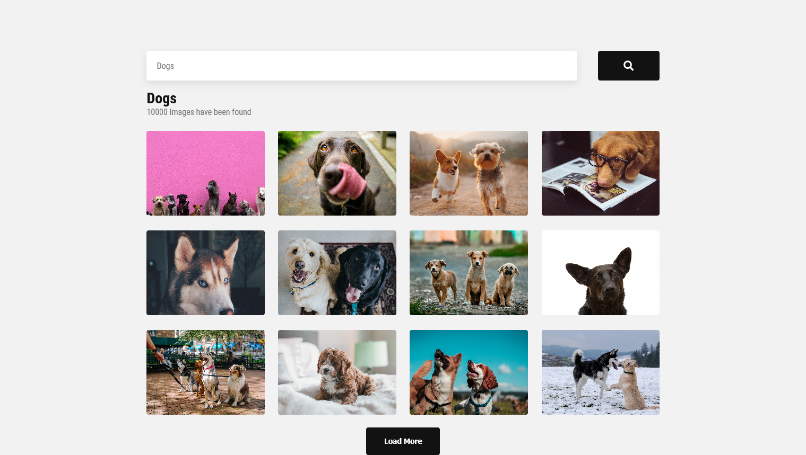
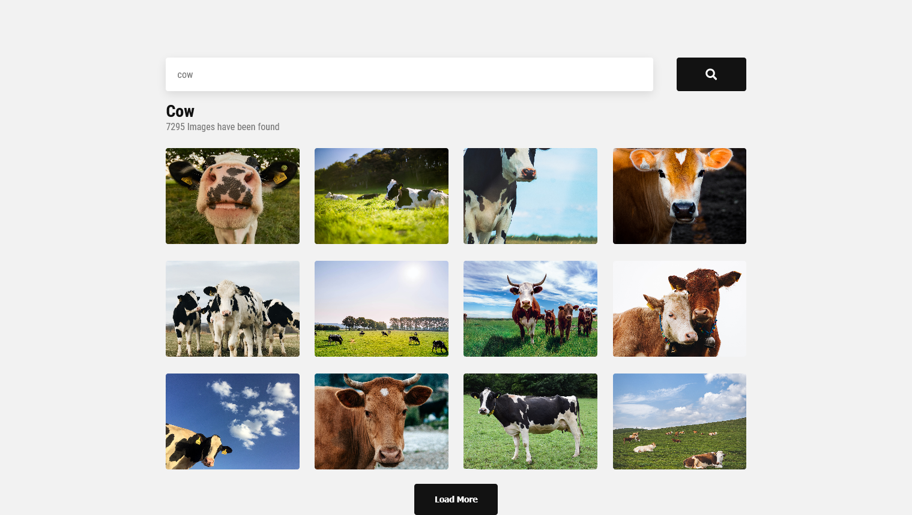
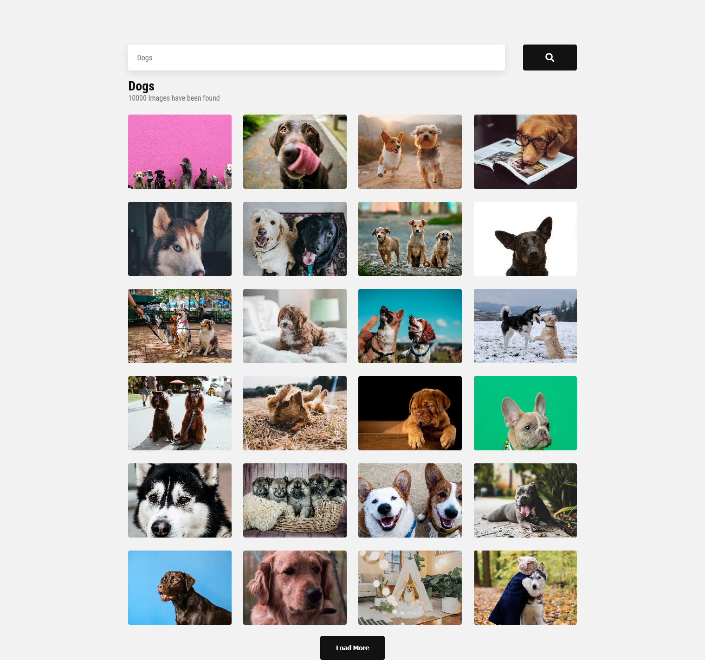

### Screenshot

<h2>Initial View</h2>

<h2>Search View</h2>

<h2>Load More View</h2>

### Built with

- Semantic HTML5 markup
- CSS Grid
- Flex Box
- React Hooks
- Unsplash API

### Features

- Single Page Application
- Image rendering starts as soon as any letter is changed in Search Bar (No need to press Enter or Search Button)
- Load More button will add more images when clicked

## Author

- Github - [@shmiitg](https://github.com/shmiitg)
